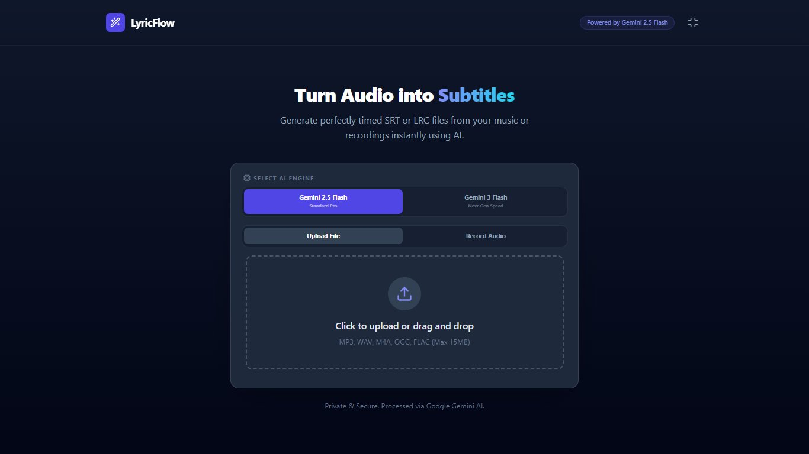
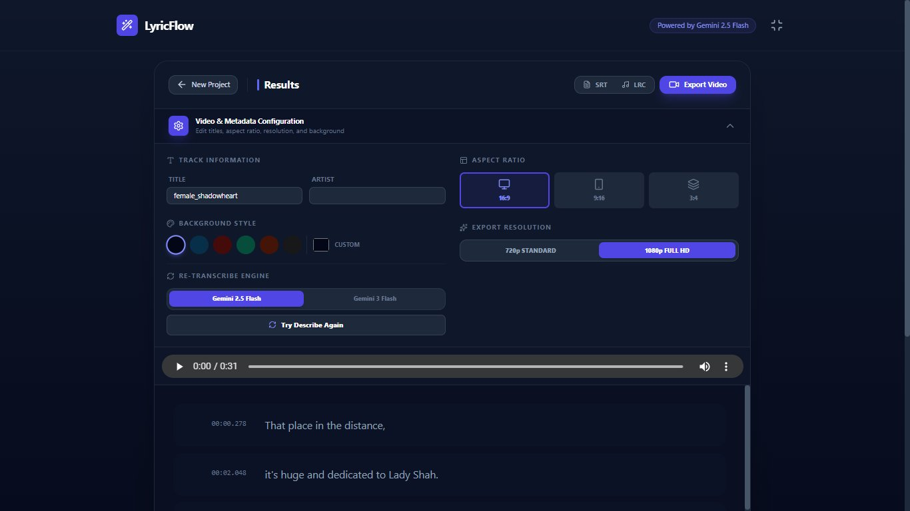

# LyricFlow - AI Subtitle & Video Generator

LyricFlow is a high-performance web application that transforms music and voice recordings into perfectly timed subtitles (`.srt`), lyrics (`.lrc`), and high-fidelity, social-media-ready videos. Powered by Google's **Gemini 2.5 Flash**, it offers studio-grade precision with an intuitive, modern interface.

## 🖼️ Screenshots

### Main Interface

*Simple, dual-mode input for local files or live recording.*

### Results & Export Studio

*Real-time preview, metadata editing, and advanced video export controls.*

## ✨ Key Features

*   **🎬 Pro Video Export Engine**: 
    *   **Multiple Aspect Ratios**: Supports 16:9 (Landscape), 9:16 (Vertical/Reels), and 3:4 (Instagram Feed).
    *   **Audio-Reactive Visualizer**: A real-time frequency analyser renders synchronized bars that dance to your music during export.
    *   **Cinematic Typography**: Intelligent multi-line text wrapping with perfect vertical centering and high-contrast shadows.
    *   **Abort Control**: Safe termination of render processes at any time.
*   **🎼 Smart LRC & SRT Generation**:
    *   **Intelligent Gapping**: Automatically inserts "clear" timestamps for silent gaps longer than 4 seconds.
    *   **Track Metadata**: Embed Title, Artist, and Album tags directly into your LRC files.
*   **🧠 AI-Powered Transcription**:
    *   **High-Precision Timing**: Utilizes Gemini's `thinkingBudget` to ensure millisecond-accurate lyric synchronization.
    *   **Multi-Language Support**: Seamlessly handles various languages and musical genres.

## 🚀 Workflow

1.  **Input**: Upload an audio file (up to 15MB) or use the built-in microphone for live sessions.
2.  **AI Analysis**: The system processes the audio through Gemini to identify speech patterns and precise timing.
3.  **Review**: Interactively seek through the audio by clicking on subtitle segments.
4.  **Customize**: Open the **Video & Metadata Configuration** to tweak the visual output.
5.  **Export**: Download text-based subtitle files or render a full-motion `.webm` video with synchronized audio.

## 🛠️ Technical Details

*   **Engine**: Gemini 2.5 Flash
*   **Video Capture**: Browser-native `MediaRecorder` + `CanvasRenderingContext2D`
*   **Audio Stack**: Web Audio API (`AnalyserNode`, `MediaStreamDestination`)
*   **Frontend**: React 19 + Tailwind CSS + Lucide Icons

---
*Developed with focus on aesthetics and functionality. LyricFlow - Bringing your sound to life.*